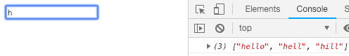
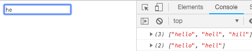
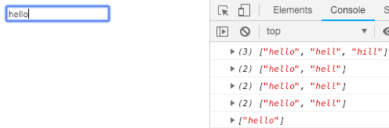

# AutoComplete.js
Small &amp; fast autocomplete library in just 50 lines of code!

## Setup

### HTML:
```html
<input id="example">
```
### JS:
```javascript
let input = new AutoComplete(["hello","hell","hill","welcome"], "#example", (completeValues) => {
    console.log(completeValues);
});
```
## Example



